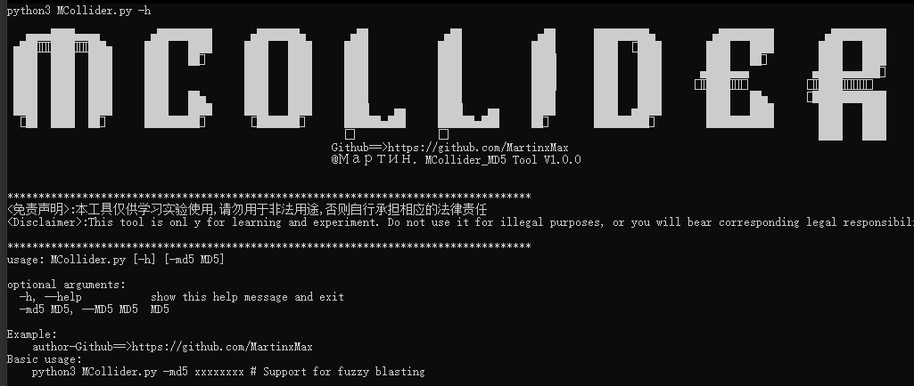
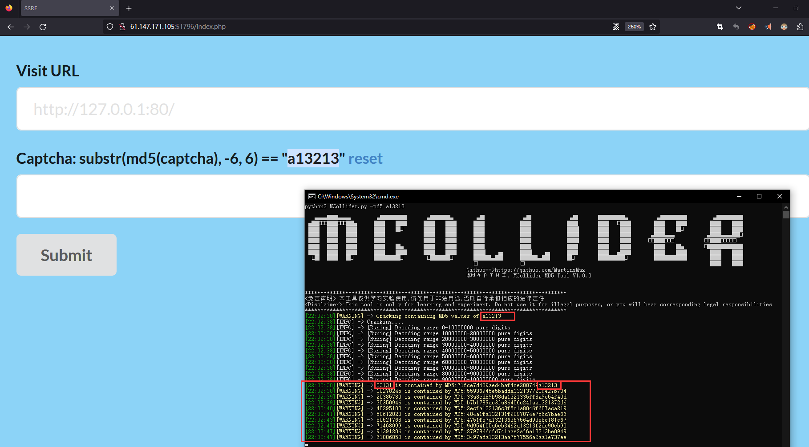
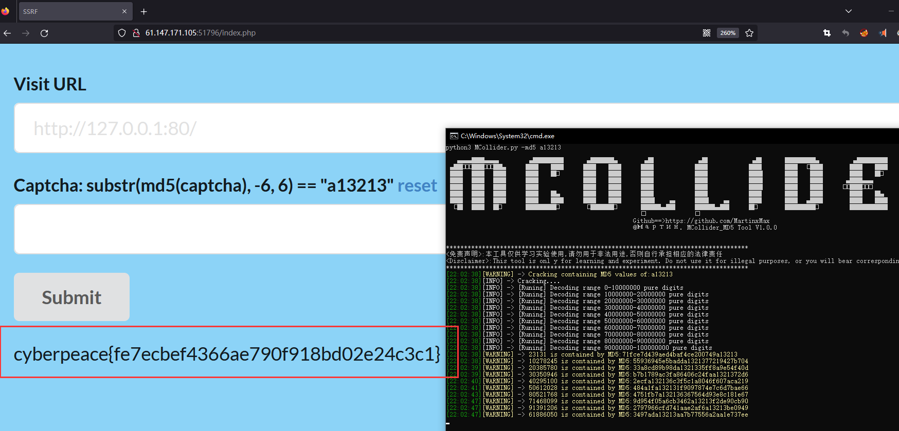

  <div align="center">
<p align="center">
 
 
 
  
 
 
 </p>
  
  
   
 <table>
  <tr>
      <th>Function</th>
  </tr>
  <tr>
    <th>Digital Blasting MD5</th>
  </tr>
 
 </table>
</div>

## usage method
  * View help information

      ```#python3 MCollider.py -h```

    

# MD5 Blast

 ```#python3 MPHP.py -md5 a13213```


    


    
  
 
